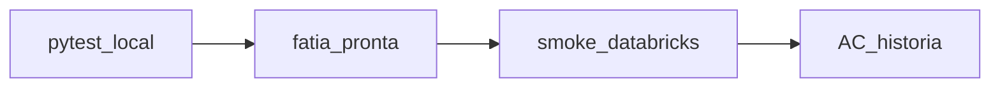

# Validação, paridade (legado x lib) e Databricks

**Versão:** v0  
**Uso:** alinhar a equipe sobre **como** provar que a lib reproduz o comportamento acordado e **quando** validar no cluster.

---

## Por que isso existe

O legado está em **vários notebooks** com pequenas variações. Os testes com `pytest` no repositório são rápidos e obrigatórios, mas **não substituem** o ambiente real do Databricks (ex.: binário **Pandoc** no PATH, versões de bibliotecas), que pode alterar sobretudo entradas **RTF/HTML**.

---

## Base conceitual (resumo)

- **Pirâmide de testes:** muitos testes unitários em baixo (fixtures sintéticas); menos testes dependentes de ambiente no topo.
- **Golden / regressão:** para cada entrada sintética controlada, fixa-se a saída esperada (ou critério de comparação, ex. normalização de espaços) para detectar regressões ao refatorar.
- **SPEC / contrato:** antes de codar, definem-se entrada, saída, limites e casos de borda; veja o checklist Fase 1.

---

## Escopo neste projeto

- Histórias e entregas: **Fase 1** em `anexo03-historias-e-tasks-v0.md` (ex.: **S01** TextPipeline, **S05** notebook orquestrador, **S06** validação paralela).
- **Sem dados de paciente (PHI)** em arquivos versionados no Git; apenas textos sintéticos ou padrões reescritos.
- Trabalho de código deve estar ligado a **história/task acordada**; ver `.cursor/rules/motor-nlp.mdc` (seção Escopo e backlog).

---

## Matriz sugestiva (preencher por módulo ou API pública)

| Módulo/API | História/task | Referência legado (qual notebook / função) | Teste local (`pytest`) | Critério de paridade | Passo no Databricks (o que rodar / observar) | Risco de ambiente |
|------------|---------------|---------------------------------------------|-------------------------|----------------------|---------------------------------------------|-------------------|
| Ex.: `to_plain` | S01 T01.1 | Notebook base acordado (ex.: biliar) | Casos em `tests/` | Igual após norm. de espaço, ou idêntico — **definir** | Smoke: import, 3–5 chamadas com mesmos inputs | Pandoc ausente = caminho striprtf |
| *(novas linhas)* | ... | ... | ... | ... | ... | ... |

Quando dois notebooks divergem, a **equipe escolhe uma referência única** por módulo; o teste documenta essa escolha.

---

## Quando validar no Databricks

**A — Smoke (frequente, curto)**  
Após uma **fatia pronta** com **pytest verde** no repositório: no cluster, instalar a lib, importar, executar poucas chamadas com os mesmos **inputs sintéticos** (ou tabela interna **sem PHI**).

**B — Gate de aceite da história**  
Antes de considerar atendido o **AC** da história no `anexo03`, repetir os critérios críticos no **mesmo stack** de uso alvo (cluster, instalação).

A base da pirâmide continua no **Git**; o Databricks **não** substitui milhares de asserts locais.

---

## Databricks e import da lib

- Instalar o **mesmo pacote** que se desenvolve (editable/wheel), conforme alinhamento da **equipe** (MLOps).
- O **notebook** fica com orquestração (~50 linhas): carrega config, chama a API da lib, escreve saída.
- **Evitar** copiar árvore de código manualmente para o Workspace só para import; isso gera fork e perde rastreio com o Git.

---

## Próximo passo técnico no backlog

Após estabilizar **S01 T01.1** (`to_plain`), o fluxo mapeado segue para **S01 T01.2** (segmentação por seção/órgão), sempre com SPEC + testes + linha desta matriz para validação quando a fatia fechar.

---

**Referências:** `anexo03-historias-e-tasks-v0.md`, `checklists/checklist-implementacao-motor-nlp-fase1-v0.md`, `diretriz-tech-lead-refatoracao-v0.md`.
